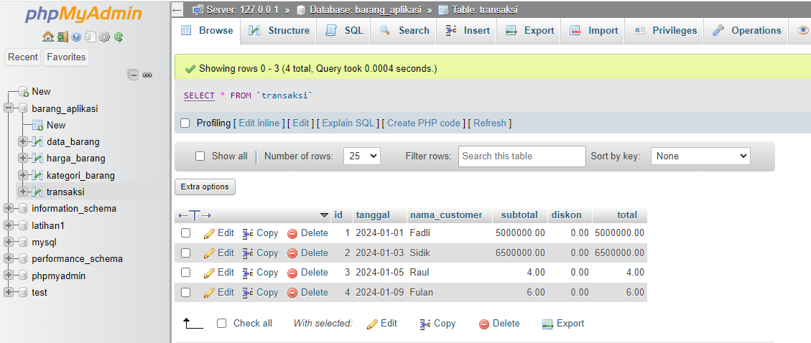

#UAS-PEMROGRAMAN-VISUAL-DEKSTOP
**Nama   : Arjun Syah**  
**Nim   : 312110102**  
**Kelas : TI.21.A3**  
##APLIKASI BARANG
##Database yang digunakan

#Pembahasan
Aplikasi ini adalah aplikasi sederhana yang memungkinkan pengguna untuk melakukan manajemen data barang dan transaksi penjualan. Dibuat untuk membantu pengguna dalam melakukan operasi dasar seperti login, manajemen data master, dan pembuatan laporan.

## Fitur-Fitur Utama

### 1. Login
   - Fitur login untuk memastikan akses yang aman ke aplikasi.

### 2. Data Master
   - Menyediakan fungsionalitas untuk mengelola data master, seperti data pelanggan, data supplier, dll.

### 3. Data Barang
   - Memungkinkan pengguna untuk menambah, mengedit, dan menghapus informasi mengenai barang atau produk.

### 4. Data Kategori Barang
   - Fasilitas untuk mengelola kategori barang atau produk.

### 5. Transaksi Penjualan
   - Melibatkan fungsi untuk mencatat transaksi penjualan, mengelola inventaris, dan mencetak faktur atau nota transaksi.

### 6. Laporan
   - Menyediakan laporan penjualan, stok barang, atau laporan lainnya yang berguna bagi pengguna.

## Cara Penggunaan

1. **Login:**
   - Masukkan kredensial yang valid untuk mengakses aplikasi.

2. **Data Master:**
   - Gunakan menu ini untuk mengelola data master seperti pelanggan, supplier, dll.

3. **Data Barang:**
   - Tambahkan, edit, atau hapus informasi tentang barang atau produk.

4. **Data Kategori Barang:**
   - Kelola kategori barang untuk lebih memudahkan pengelolaan inventaris.

5. **Transaksi Penjualan:**
   - Catat penjualan, kelola stok, dan cetak faktur atau nota transaksi.

6. **Laporan:**
   - Akses laporan yang disediakan untuk mendapatkan wawasan tentang aktivitas penjualan dan stok barang.

## Kontribusi

Jika Anda ingin berkontribusi pada pengembangan aplikasi ini, silakan ikuti langkah-langkah berikut:
1. Fork repositori ini.
2. Buat branch baru (`git checkout -b fitur-baru`).
3. Lakukan perubahan dan commit (`git commit -am 'Menambahkan fitur-baru'`).
4. Push ke branch (`git push origin fitur-baru`).
5. Buat pull request.
